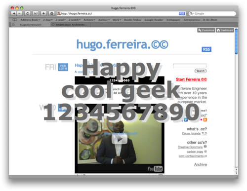

* *Number of seconds since `epoch` (1970-01-01 00:00:00) in Unix time  
  or **2009-02-13 at 23:31:30 UTC** in “civilian” date.*

A [cool geek moment](http://pdvel.com/happy1234567890/), by [pdvel](http://twitter.com/suskind):

**Update:** The fireworks! Snapshot of the above script in action:

