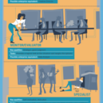

<figure>
</figure>

(via [#E2sday: Roles on a Team and How They Apply to the Enterprise  | 
The Future of
Work](http://blog.socialcast.com/e2sday-roles-on-a-team-and-how-they-apply-to-the-enterprise/)
)

