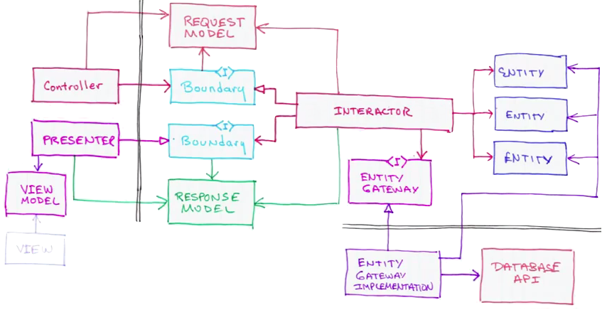

[Keynote: Architecture the Lost Years](http://www.confreaks.com/videos/759-rubymidwest2011-keynote-architecture-the-lost-years) by Robert Martin @ Ruby Midwest 2011

*(also on
[YouTube](http://www.youtube.com/watch?v=WpkDN78P884&feature=player_detailpage#t=2546s)
... and a few weeks later,* *without slides* *, on [The "A" word. A
Discussion About Architecture](http://vimeo.com/30083598) in a*
*Software Craftsmanship conference* *)*

Images clipped together from...

-   The "Presenter" and "View Model" at
    [35:28](http://www.youtube.com/watch?v=WpkDN78P884&feature=player_detailpage#t=2128s)
-   "The whole Enchilada!" at
    [37:50](http://www.youtube.com/watch?v=WpkDN78P884&feature=player_detailpage#t=2270s)
-   "The Database is a Detail!" at
    [42:26](http://www.youtube.com/watch?v=WpkDN78P884&feature=player_detailpage#t=2546s)

Elements summary:

>
> **Entities** --- Generic application agnostic data and business rules
> (e.g. *Order, Customer* ).
>
> **Interactors** --- Application specific business rules; Manipulates
> the relevant data from the Request Model and interacts with the
> Entities.
>
> **Boundaries / Gateways** --- Protocols or Interfaces.
>
> **Models** --- Dumb data structures, without methods.
>
> -   Request Model
> -   Response Model
> -   View Model
>
> **Controllers** --- Convert the stuff submitted by the delivery
> mechanism into a delivery agnostic Request Model.
>
> **Presenters** --- Turns the delivery agnostic Response Model into a
> prepared "viewbified" data structure ready for easy manipulation by
> the view.
>
> -   *"... so the view is so stupid that you don't have to test it!"*

See also [Where's Your Business
Logic?](http://collectiveidea.com/blog/archives/2012/06/28/wheres-your-business-logic/)

