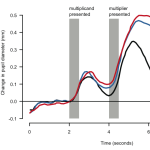

<figure>
</figure>

> -    A programmer takes between 10-15 minutes to start editing code
>     after resuming work from an interruption.
> -    When interrupted during an edit of a method, only 10% of times
>     did a programmer resume work in less than a minute.
> -    A programmer is **likely to get just one uninterrupted 2-hour
>     session** in a day

(via [Programmer
Interrupted](http://blog.ninlabs.com/2013/01/programmer-interrupted/) )

