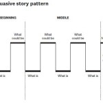

<figure>
</figure>

> And here's how to do it in your own presentations:
>
> 1.  Craft the Beginning
> 2.  Develop the Middle
> 3.  Make the Ending Powerful

(via [Structure Your Presentation Like a Story -- Nancy Duarte --
Harvard Business
Review](http://blogs.hbr.org/cs/2012/10/structure_your_presentation_li.html)
)

See also the related TED presentation: [Nancy Duarte: The secret
structure of great talks  |  Video on
TED.com](http://www.ted.com/talks/nancy_duarte_the_secret_structure_of_great_talks.html)

