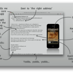

<figure>
</figure>

> First and foremost, all we really did was our best implementation of
> what [Chris Phin](http://app.net/chrisphin) asked all App Makers to do
> in his talk at [NSConference 5](http://nsconference.com/) . Our
> "perfect press release," was literally just a point for point copy of
> the ideal press release from his talk, which I hope nobody will mind
> me sharing here.

(via [Launch Thanks  |  mur.mu.rs](http://mur.mu.rs/611) )

