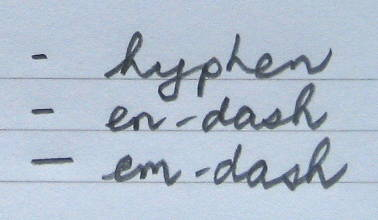

<figure>
</figure>

-   --
    [hyphen](http://thewritepractice.com/create-your-own-words-and-other-uses-of-the-hyphen/)
    = connect things to be used as one word/unit
-   --
    [n-dash](http://thewritepractice.com/whats-an-en-dash-and-how-to-use-it-correctly/)
    = indicates a range, as in: X--Y (from x to y)
-   ---
    [m-dash](http://thewritepractice.com/what-the-heck-is-an-em-dash/) =
    break in narration, a short aside

