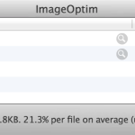

<figure>
</figure>

> ImageOptim optimizes images --- so they take up less disk space and
> load faster --- by finding best compression parameters and by removing
> unnecessary comments and color profiles. It handles PNG, JPEG and GIF
> animations. (via [ImageOptim --- better Save For
> Web](http://imageoptim.com/) )

