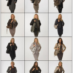

<figure>
</figure>

> Inspired by a shared interest in the striking dress codes of various
> social groups, they have systematically documented numerous identities
> over the last 19 years. Rotterdam's heterogeneous, multicultural
> street scene remains a major source of inspiration for Ari Versluis
> and Ellie Uyttenbroek (...)
>
> They call their series **Exactitudes** : a contraction of exact and
> attitude. By registering their subjects in an identical framework,
> with similar poses and a strictly observed dress code, Versluis and
> Uyttenbroek provide an almost scientific, anthropological record of
> people's attempts to distinguish themselves from others by assuming a
> group identity.

(via
[Exactitudes®](http://www.exactitudes.com/index.php?/series/overview/140)
)

