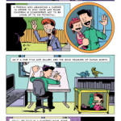

<figure>
</figure>

> It's pretty incredible when you think about. Could you say 'no' to
> millions, I repeat, MILLIONS of dollars of merchandise money? I don't
> know if I could. Would you stop creating your art if millions of
> people admired your work and kept wanting more? I don't know if I
> would.

Life, goals, and advice in the illustrated words of Bill Watterson (via
[ZEN PENCILS -- 128. BILL WATTERSON: A cartoonist's
advice](http://zenpencils.com/comic/128-bill-watterson-a-cartoonists-advice/)
)

