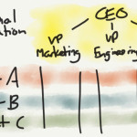

<figure>
</figure>

<figure>
</figure>

<figure>
</figure>

<figure>
</figure>

<figure>
</figure>

Part 1: [Why Microsoft's reorganization is a bad
idea](http://stratechery.com/2013/why-microsofts-reorganization-is-a-bad-idea/)

Part 2: [The uncanny valley of a functional
organization](http://stratechery.com/2013/the-uncanny-valley-of-a-functional-organization/)

Part 3: [Services, Not Devices is the best way forward for
Microsoft](http://stratechery.com/2013/services-not-devices/)

*(via [stratēchery by Ben Thompson](http://stratechery.com) )*

