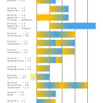

<figure>
</figure>

> **Visualizing CAMediaTiming**
>
> To show the different timing related properties, both on their own and
> in combination, I'm animating a color from orange to blue. The block
> shows the progress of the animation from start to finish (orange to
> blue) and the ticks on the timeline are one second apart.

(via [Controlling Animation
Timing](http://ronnqvi.st/controlling-animation-timing/) )

