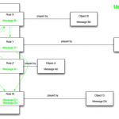
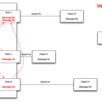

<figure>
</figure>

<figure>
</figure>

> **What OO Fails to Do**
>
> What object oriented programming fails to do is express collaborations
> between objects. To show you exactly what I mean, let's take a look at
> two system operations (two use cases) requiring the same group of
> objects collaborating with each other.
>
> (...)
>
> **DCI to the Rescue**
>
> DCI is a paradigm invented by [Trygve
> Reenskaug](http://en.wikipedia.org/wiki/Trygve_Reenskaug) (the
> inventor of the MVC pattern) to solve these problems.

(via [Data Context Interaction: The Evolution of the Object Oriented
Paradigm --
SitePoint](http://www.sitepoint.com/dci-the-evolution-of-the-object-oriented-paradigm/)
)

See also [A DCI Execution Model, by Trygve
Reenskaug](http://folk.uio.no/trygver/2012/DCIExecutionModel-2.1.pdf)
(PDF).

