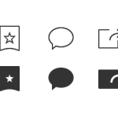

<figure>
</figure>

> Why hollow icons are more work for your users and ultimately create cognitive fatigue.

(via [Hollow Icons --- Design/UX ---
Medium](https://medium.com/design-ux/a93647e5a44b) )

