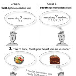

<figure>
</figure>

> **Willpower and cognitive processing draw from the same pool of
> resources.**\
> (...)\
> Since both willpower/self-control and cognitive tasks drain the same
> tank, deplete it over here, pay the price over there. One pool. One
> pool of scarce, precious, easily-depleted resources. If you spend the
> day exercising self-control (angry customers, clueless co-workers), by
> the time you get home your cog resource tank is flashing E.

(via [Your app makes me fat --- Serious
Pony](http://seriouspony.com/blog/2013/7/24/your-app-makes-me-fat) )

