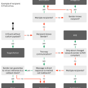

<figure>
</figure>

>
> The number of patterns available to communicate information between
> objects can be overwhelming at first. The choice of which pattern to
> use often feels ambiguous. But once we investigate each pattern more
> closely, they all have very unique requirements and capabilities.

(via [Communication Patterns -- Foundation -- objc.io issue
#7](http://www.objc.io/issue-7/communication-patterns.html) )

