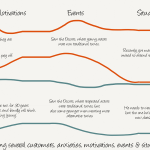

<figure>
</figure>

> The way to mitigate these unintended effects is to replace *Personas*
> with models that enable cohesive stories. These models are called
> *Characters* .

> What would make sense for the brain is a believable story which
> explains that purchase. This is what we can use Characters for. A
> Character is someone who:
>
> 1.  Has anxieties & motivations.
> 2.  Experiences purchase-progress events.
> 3.  Encounters purchase-progress situations.

(via [Replacing Personas With Characters ---
Medium](https://medium.com/@alanklement/aa72d3cf6c69) )

