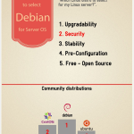

<figure>
</figure>

(via [Five Reasons to use Debian as a
Server](http://www.pontikis.net/blog/five-reasons-to-use-debian-as-a-server)
)

What to choose for a low maintenance, secure and reliable server-side
Linux distro: **Debian**

-   Rock solid and stable
-   Easy and smooth upgrades, even between major versions
-   Best of breed package manager

Search inspired by Marco Arment's [Web Hosting For App
Developers](http://www.marco.org/2014/03/27/web-hosting-for-app-developers)
post.

