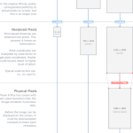

<figure>
</figure>

(via [iPhone 6 Screens Demystified  | 
PaintCode](http://www.paintcodeapp.com/news/iphone-6-screens-demystified)
)

See also [The Curious Case of iPhone 6+ 1080p
Display](https://medium.com/@brucewangsg/the-curious-case-of-iphone-6-1080p-display-b33dac5bbcb6)

