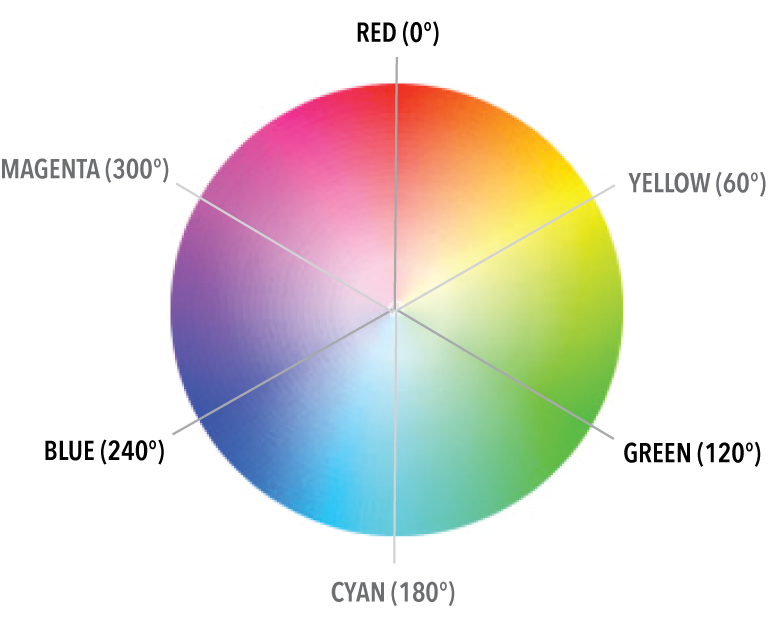

> With practice, this new mental map of color will become instinctive:
> you'll likely find that it is much easier to create and manipulate
> color specified in HSL in your stylesheet code than hex or RGB.

See also [Three Ways You Should Be Using HSL Color In Your Site Today](http://demosthenes.info/blog/576/Three-Ways-You-Should-Be-Using-HSL-Color-In-Your-Site-Today).

