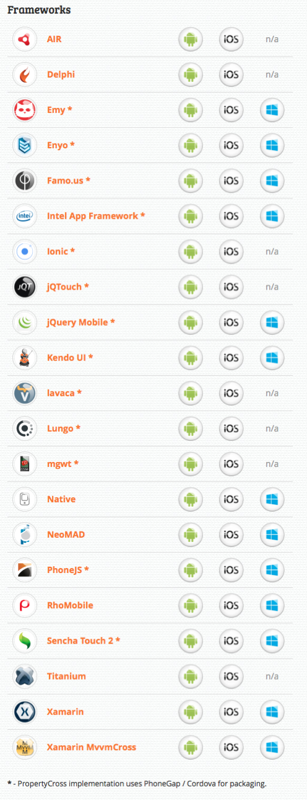

[{width="496"
height="1290"
srcset="tumblr_niy2fjyTFG1qz82meo2_r1_1280.png 496w, tumblr_niy2fjyTFG1qz82meo2_r1_1280-115x300.png 115w, tumblr_niy2fjyTFG1qz82meo2_r1_1280-394x1024.png 394w"
sizes="(max-width: 496px) 100vw, 496px"}](http://propertycross.com/)

> Developers are now finding themselves having to author applications
> for a diverse range of mobile platforms (iOS, Android, Windows Phone,
> ...), each of which have their own 'native' development languages,
> tools and environment. (...) but which to choose?
>
> (...)
>
> **[PropertyCross](http://propertycross.com/)** presents a
> **non-trivial application** , for searching UK property listings,
> developed **using a range of cross-platform technologies** and
> frameworks. Our aim is to provide developers with a practical insight
> into the strengths and weaknesses of each framework.

