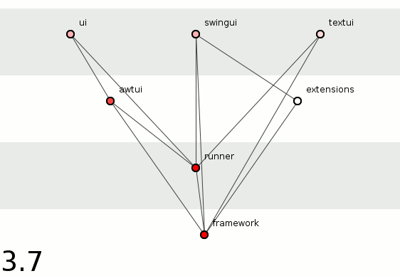
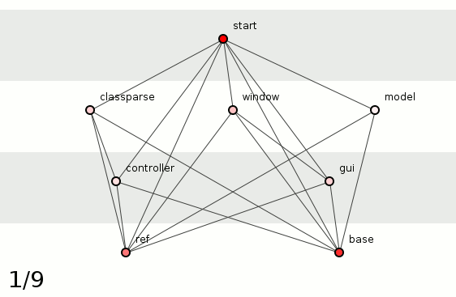

[{width="562"
height="388"}](junit-anim.gif)

> By version 4.11, transitive dependencies have proliferated seemingly
> unchecked. We are far from the short dependency-chains and few
> cyclic-dependencies of good structure.

A better way...

> There are many ways to do this, but one way is to practice [radial
> encapsulation](http://edmundkirwan.com/general/radial2.html) .
> (...) shows the evolution of a radially-encapsulated program that is
> bigger than JUnit yet has throughout its history retained a structural
> clarity that JUnit seems to have abandoned.

[{width="562"
height="367"}](spoiklin-anim.gif)

> **Programmers should be forced to wear their systems'
> package-structures on their tee-shirts.**

(via [The structure of JUnit --
EdmundKirwan.com](http://edmundkirwan.com/general/junit.html) )

[technical
