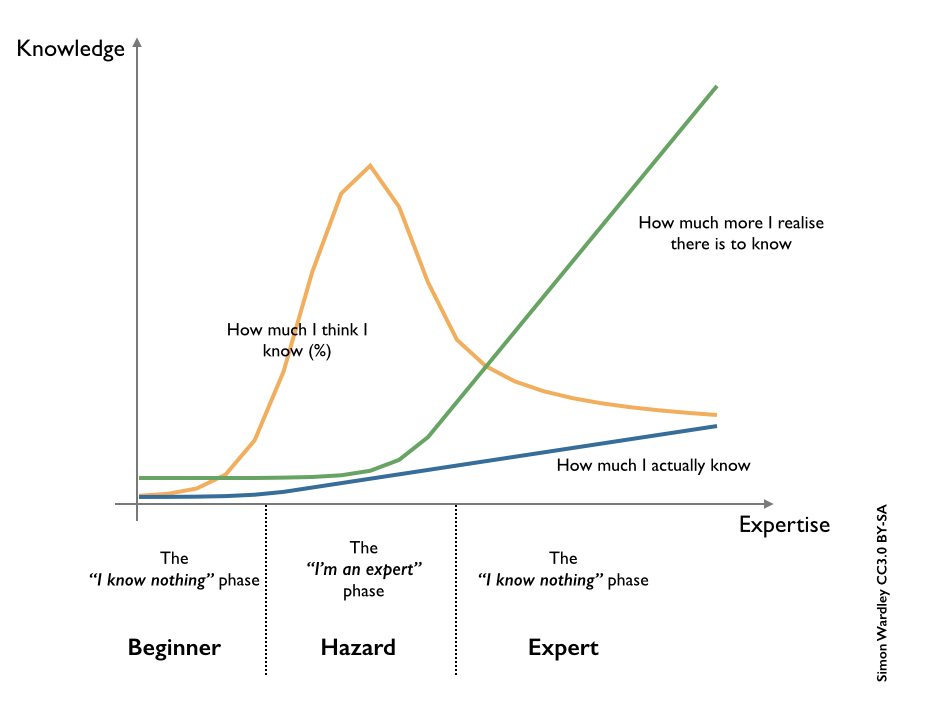

<figure style="width: 937px">

<figcaption>VC funding. Our perspectives on the topic wax and wane
[…]</figcaption>
</figure>

Source: *[What I've Learned About Venture Funding | Bothsides of the
Table](http://www.bothsidesofthetable.com/2015/08/20/what-ive-learned-about-venture-funding/)*
