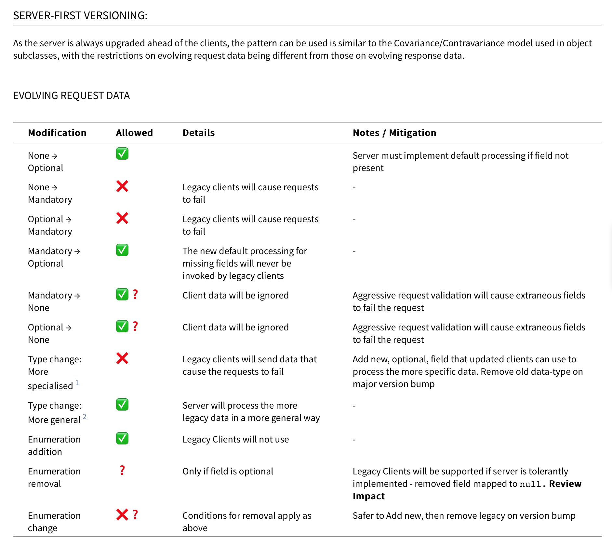
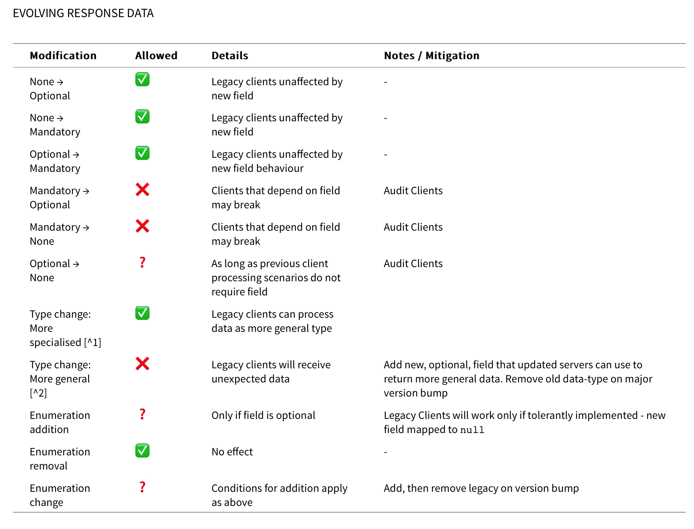
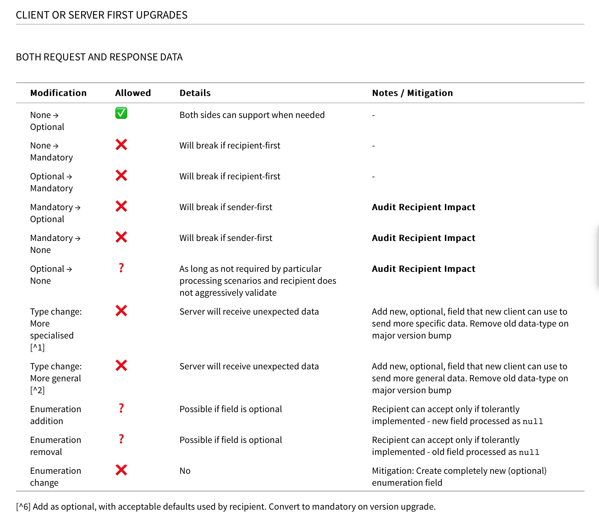

2017-06-07

Nuno Marques
https://equalexperts.slack.com/archives/C51U24LKA/p1496776771502671
> but about the rules of thumb i use to build rest apis are usually only 2
>
> - be very strict on what you send and flexible on what you receive
> - do not remove any piece of data that you've shared before

https://equalexperts.slack.com/archives/C51U24LKA/p1496791682545826?thread_ts=1496791369.489525&channel=C51U24LKA
> @dhamilton i think this table and the response table can be resumed in two observations: you can't raise the strictness of what is requested to you and you can't increase the relaxation of what you respond, which goes hand in hand with my first rule. but you can relax safely what is requested to you and you can become more strict on what you respond
> for the client this two observations are reversed and you don't really care who changes first

Steve Smith
https://equalexperts.slack.com/archives/C51U24LKA/p1496784633936469?thread_ts=1496776500.409107&channel=C51U24LKA
>>> FWIW my rules of thumb are:

- Sharing logic is a smell of poor design and badly defined bounded contexts. Using a DDD lens, that applies to Value Objects as well as Services and Entities. You're better off duplicating Value Objects 
- Sharing infrastructure logic is always more tempting and sometimes correct. But the coupling trade off needs to be considered 
- Always attempt to decouple before deduplicating

The DRY Principle frequently applies _within_ a bounded context, but rarely _between_ them

—//—

by @dhamilton

Those assume server-first deployment. Of course if that can't be assumed you get:

