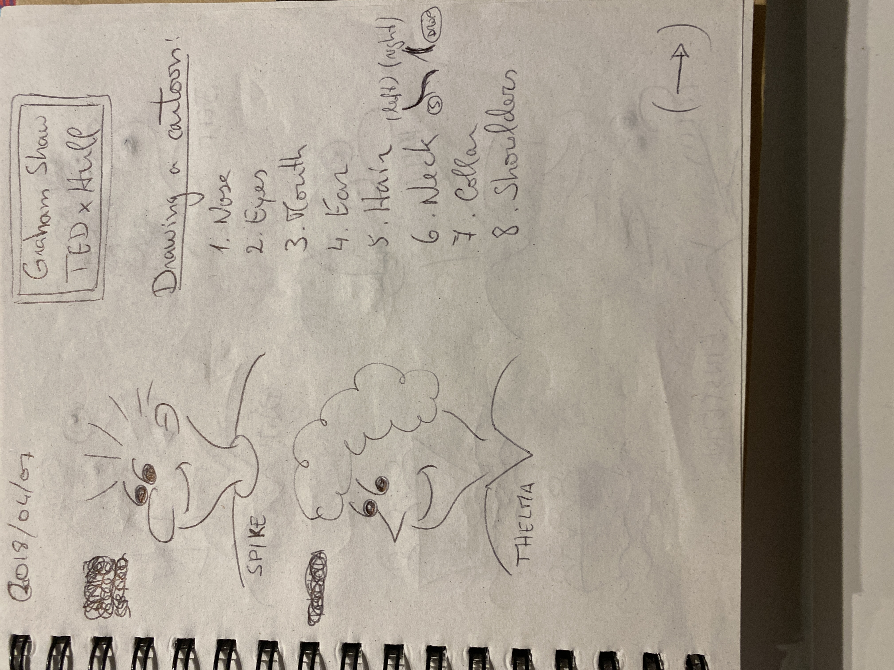
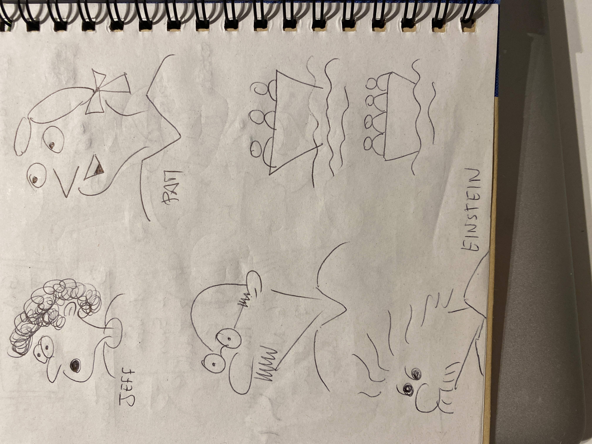
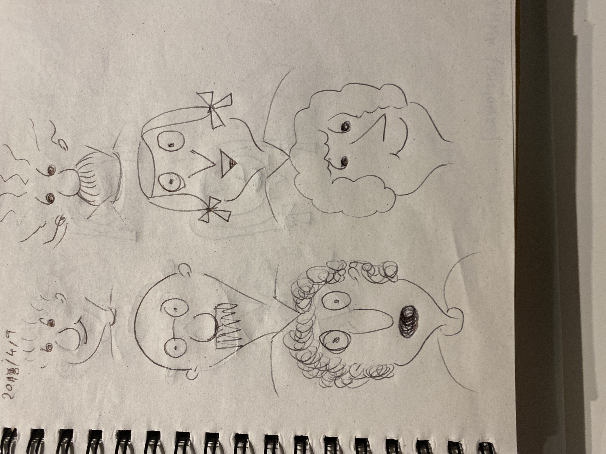

# 2018-04-07

The great **Graham Shaw** on how *anyone* can draw:
Why people believe they can’t draw - and how to prove they can | Graham Shaw | TEDxHull

[https://www.youtube.com/watch?v=7TXEZ4tP06c](https://www.youtube.com/watch?v=7TXEZ4tP06c)

… and how useful drawing is to study and remember things:
How to draw to remember more | Graham Shaw | TEDxVienna

[https://www.youtube.com/watch?v=gj3ZnKlHqxI](https://www.youtube.com/watch?v=gj3ZnKlHqxI)

* Retype my “Drawing a cartoon” in text
* Crop these images below

******Update 2018-04-09:****** Exploring other orientation angles.**

