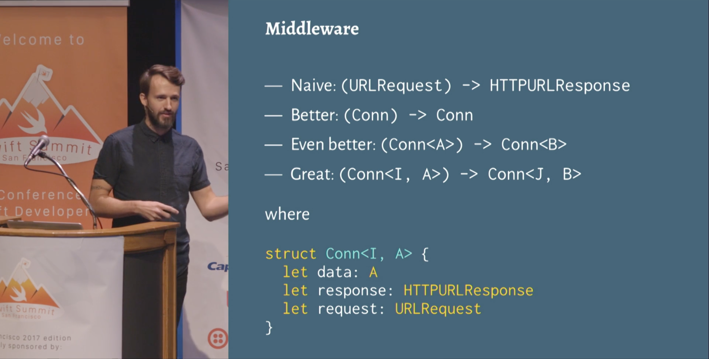

# 2018-07-05

> Then, a great way, like a really advanced way is to make it ****generic over an additional parameter that won't actually even be used**** anywhere in the type and ****this is known as a phantom type****. This is the actual type, this is pretty much the exact type we use, and you'll notice that the I doesn't show up anywhere in the type at all.
> This allows you to actually encode a kind of state machine in the type system where you are not allowed to do invalid things on certain states.

[https://www.skilled.io/u/swiftsummit/server-side-swift-from-scratch](https://www.skilled.io/u/swiftsummit/server-side-swift-from-scratch)

