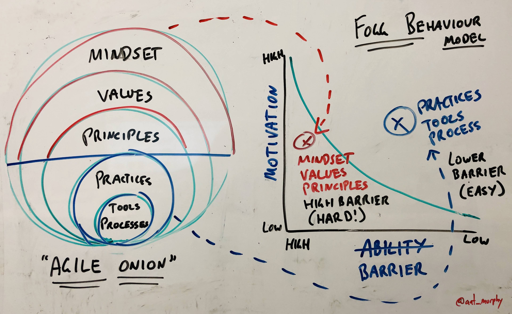

2019-08-25

> Rather the [law of critical mass](https://en.wikipedia.org/wiki/Critical_mass_(sociodynamics)) tends to make its mark — … _only when a large enough portion of people have adopted the change will it become self-perpetuating and much like a snowball rolling downhill will also attract change in others._

> 1. K2K starts any transformation much like Sahota suggests, with 100% buy-in from the CEO — no complete buy-in, no start
> 2. Second they make the CEO agree that no one gets fired
> 3. … get the company to close-up-shop for 2 full days where they get everyone together and explain the change in details. At the end of the two days they conduct an anonymous vote — K2K require over [80% of the employees](https://corporate-rebels.com/ner-group/) to vote yes to the change otherwise it again is a no go

> … only when critical mass and a high enough level of motivation is achieved should an organisation embark on a transformation, otherwise they are likely setting themselves up for failure.

> “No motivation + no critical mass = no transformation“ — a developing theory

[https://productcoalition.com/is-your-agile-transformation-failing-too-5fdd203efeee](https://productcoalition.com/is-your-agile-transformation-failing-too-5fdd203efeee)

