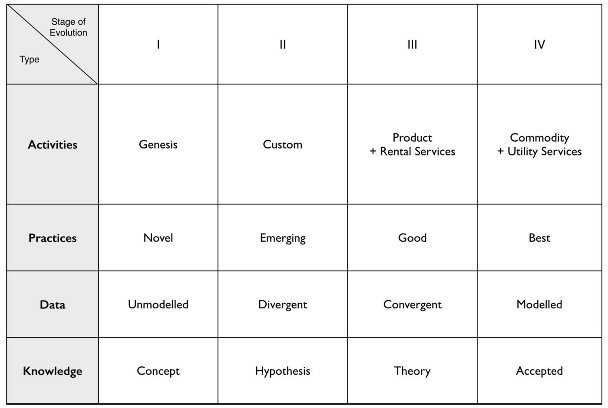
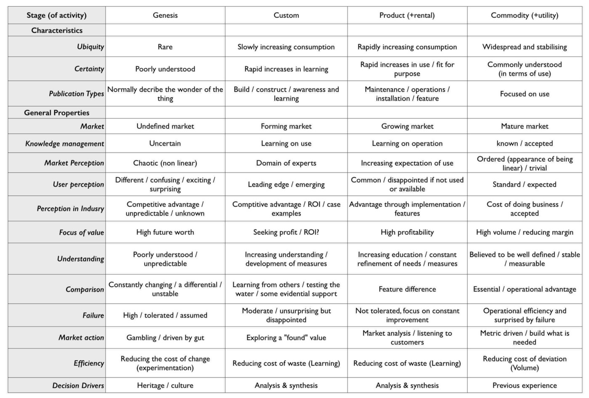

2019-09-05

Interesting insights about the x-axis of Wardley Maps and the co-evolution between **Activities**, **Practices**, **Data**, and **Knowledge**. 

> It’s worth noting that a major form of inertia to a change of an underlying technology are the best practices that existed with the less evolved technology.

TODO: 
* Clip figure 1 — Doctrine, a list of universally useful principles.
* Clip figure 4 — Stages of capital and the labels we use

[https://medium.com/@swardley/what-culture-is-right-for-you-ba892f1f3bc5](https://medium.com/@swardley/what-culture-is-right-for-you-ba892f1f3bc5)

