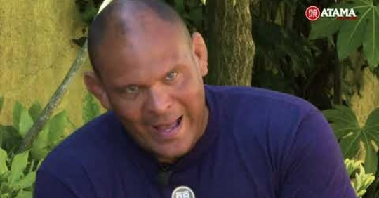

# 2019-10-06

Um grande livro, de um grande ser humano! 👏👏👏
Vale a pena ver: https://youtu.be/b8hHfI2HX4w

> Um romance de superação e esperança baseado em factos reais.
— https://www.wook.pt/…/o-ultimo-da-fila-marlon-quei…/23371769

“Bombeiro se queima, pedreiro cai do andaime, bandido leva tiro, agora escolhe o teu caminho parceiro ” — [19:49](https://youtu.be/b8hHfI2HX4w?t=1189)

“Eu tento às vezes forçar os meus filhos a olharem para eles e perceberem o quão eles são privilegiados, e minha mulher diz assim ‘não, a vida dos meus filhos é normal, a tua vida é que era uma merda’” — [28:44](‪https://youtu.be/b8hHfI2HX4w?t=1724)

