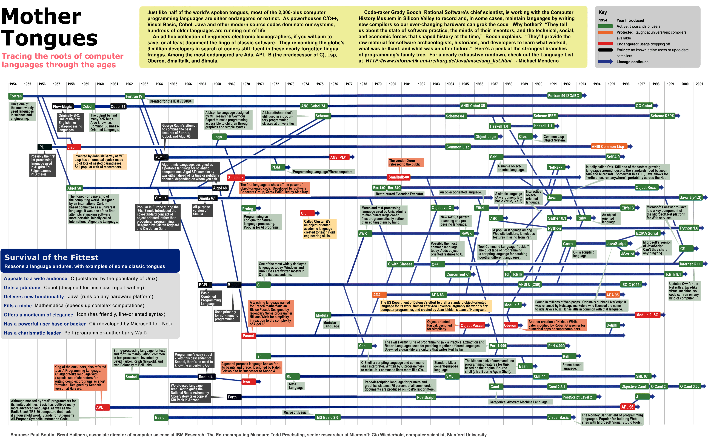

2019-10-28

> Tracing the roots of computer languages through the ages

[1954, 2001]

[https://medium.com/@damoclark/why-is-truthy-a-confusing-concept-in-modern-programming-languages-f5d2f137575d](https://medium.com/@damoclark/why-is-truthy-a-confusing-concept-in-modern-programming-languages-f5d2f137575d)

