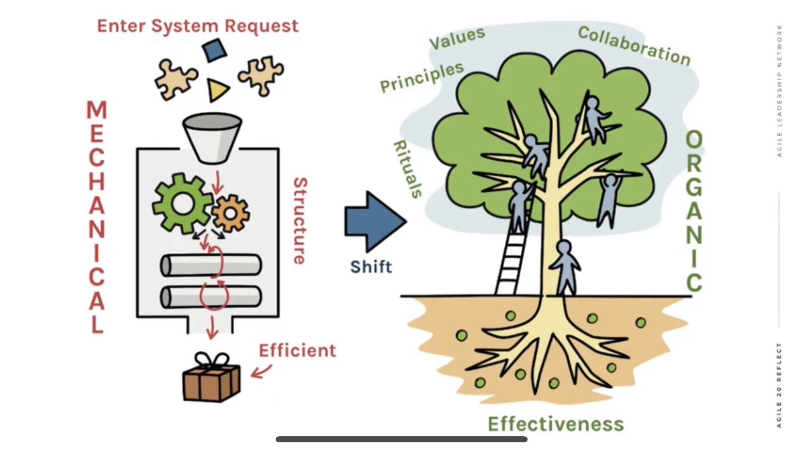

# 2021-02-20

# Scaling Has Never Worked... and Never Will

<https://youtube.com/watch?v=YhUY5olYNB4&feature=share>

> Agile is a solution to a problem. But it's not the only solution to all problems. To certain questions, agile approaches are the right answers. ... What has been good over the last 20 years is this acknowledgement that actually the mechanical metaphor that organisations have traditionally been built on, ..., isn't the right metaphor in these new circumstances that a lot of organisations find themselves in.

> ... what do I mean by this "scaling agile will never work"? Well, it's not that we can't get a agile principles throughout the organisation, it's not that we can't achieve an organisation that is built on agile values, it's also that an "agile organisation" is an oxymoron, because it's highly unlikely that an organisation will be completely agile, as per the principles of the Agile Manifesto or the rules of Scrum.

Manifesto for Half-Arsed Agile Software Development
<https://www.halfarsedagilemanifesto.org/>

