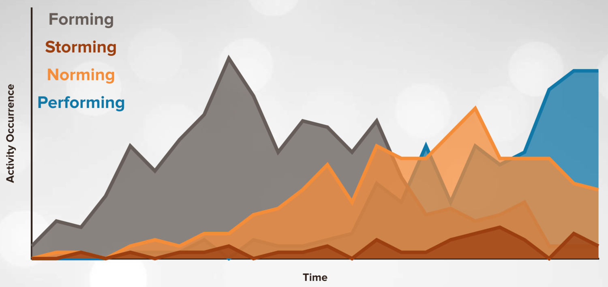

# 2022-01-14

[https://onbelay.co/articles/2017/5/5/tuckman-was-wrong](https://onbelay.co/articles/2017/5/5/tuckman-was-wrong)

> Extremely few teams had an experience that mapped to Tuckman's stages. Many teams skipped stages entirely or even passed through stages in a different sequence. Almost universally, they found it was difficult to say for sure that a team was squarely in a specific stage, rather the activities and behavior associated with a particular stage were more or less pronounced. It was hard to say any of the stages Tuckman identified were in fact stages at all. Storming, they concluded, is not a stage at all, but a consistent occurrence. And this for me, was key.

> … this large-scale study seems to support the work of Morgan, Salas, & Glickman who also built off of Tuckman, but assert that the **stages are "relatively informal, indistinct, and overlapping"** - https://en.wikipedia.org/wiki/Group_development#Morgan,_Salas_&_Glickman's_TEAM_model

* Highlight this ”emphasis added” quote first?

—//—

* Put these into a `tuckman` post and link/refer to the clippings

*Comments…*

*[from https://springernature.slack.com/archives/D017H93ABEC/p1642148811000400]*

This matches my personal experience.

I always take models with a grain of salt. Theorist tend to want to put everything neatly in a box. Reality is messy and nuanced

I like models more for giving a common language to refer to and ease communication with others (and in this case, also for the hints of what to do when each phase is ~~happening~~ more prevalent)
The “order” of it or any strict rules the model says I never really cared. The author mentions in the comments something that matches my experience: ***stages are "relatively informal, indistinct, and overlapping"***

> … this large-scale study seems to support the work of Morgan, Salas, & Glickman who also built off of Tuckman, but assert that the stages are "relatively informal, indistinct, and overlapping" - https://en.wikipedia.org/wiki/Group_development#Morgan,_Salas_&_Glickman's_TEAM_model

The “stable” teams concept is also interesting. I never equated it to “teams never changing their members” but rather “don't disband and reassemble completely” like I experienced so many times in consulting

The Author team is a good example of what I mean. I normally say to the team that whenever someone joins or someone leaves, it's a new team :slightly_smiling_face:

We've had someone joining or someone leaving probably every other month since our  inception, and yet I'd say the team remained “stable” throughout those changes but for a different definition of “stable” (i.e. supporting each other, collaborating together, etc.)

I wouldn't be surprised if it were precisely those frequent changes that kept it from “solidifying” or making it “boring”, since everyone that leaves or joins gives room to new ideas, fresh ideas, etc. — looking at the article, it seems to hint that it is so

I've mentioned to the team in several retros that the one thing the team has gotten right is the “continuous improvement mindset” so engrained in everyone — with that, it can be flexible and adjust, have low moments, high moneys, and still remain tight together (nothing is a tabu that can't be discussed, all accept trying something to see if it works, revise if it doesn't, etc.)

—//—

Why the popularity of Tuckman’s model?

> **But why is Tuckman’s model so popular then?**
>
> Here’s the author’s answer:
>
> > *[…] I coined the terms: **forming, storming, norming, and performing**-terms that would come to be used to describe developing groups for the next 20 years and **which probably account for the paper’s popularity**.*[^1]
> 
> There you have it. Easy to remember, therefore remembered.

[^1]: Bruce W. Tuckman in [Developmental Sequence in Small Groups](https://athena.ecs.csus.edu/~buckley/CSc190/GROUP%20DEV%20ARTICLE.pdf)

—//—

~~2023-10-09~~
~~
~~
~~O tal artigo que ajuda a perceber e lidar com as fases do Tuckman model:~~
~~
~~
~~Feelings; Behavious; Team Tasks~~
~~https://hr.mit.edu/learning-topics/teams/articles/stages-development~~~~
~~
* Isto está num clipping de 2020-07-01

