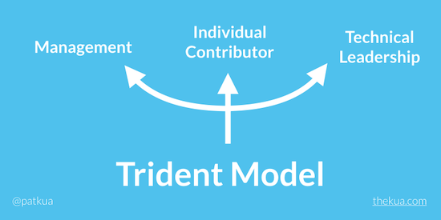

# 2022-02-20

* Same as 2021-05-24?

**## > The Management Track**
> 
> In this track, people spend a majority of their time (70-80%) on management activities.
> …
**> **Example roles in this track**:****** Engineering Manager, VP Engineering, IT Manager

**## > The Technical Leadership Track**
> 
> In this track, people spend a majority of their time (70-80%) leading people on a technical topic.
> …
**> **Example roles in this track:**** Lead Developer, Tech Lead, Principal Engineer, Software Architect

**## > The True Individual Contributor (IC) Track**
> 
> In this track, people spend a majority of they time (70-80%) focused on “Executing/Doing”.
> 
**> **Example roles in this track:**** DB Specialist, Performing Tuning Specialist, Domain Specialist.

[https://www.thekua.com/atwork/2019/02/the-trident-model-of-career-development/](https://www.thekua.com/atwork/2019/02/the-trident-model-of-career-development/)

