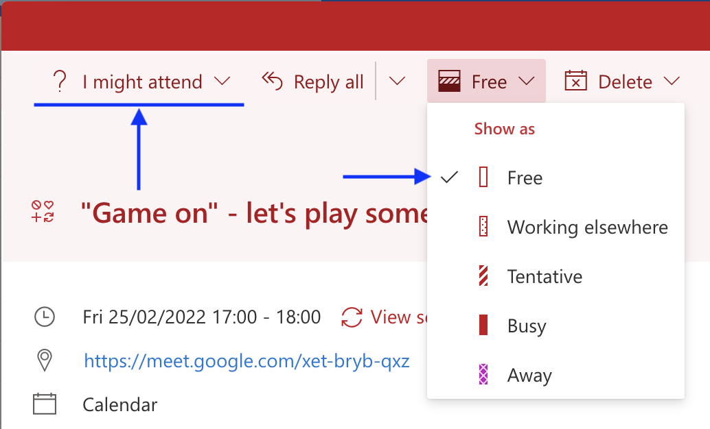

# 2022-02-25

* Did I clip my own #lifehack tip?

https://springernature.slack.com/archives/C02M6RD1EPK/p1645793269008889

> I like to have **tentative **recurring meetings in my calendar that I *might* attend on occasion (e.g. standup times of other teams) so that I can get any update or cancelation notifications but it’s very annoying that by default they show up as me being “busy” when others are trying to book meetings. I guess “maybe” for me is less of a commitment than it is for Microsoft 😁
>
> This might be obvious to many but I just found out you can keep your RSVP as tentative *and still* show them as **Free** in your calendar for others, although it takes some manual changes…
>
> Screenshot from https://outlook.office.com

