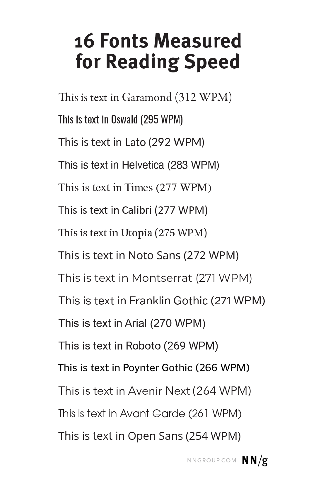

# 2022-04-16 fonts-readability

---
lang: en
tags: [ fonts, design, readability, study ]
type: photos
via: ...
---

> Among high-legibility fonts, a study found 35% difference in reading speeds between the best and the worst. People read 11% slower for every 20 years they age.

> ... was only best on average. **It wasn't best for all users**. There were substantial individual differences.

<https://www.nngroup.com/articles/best-font-for-online-reading/?utm_source=Alertbox&utm_campaign=c958e34f97-EMAIL_CAMPAIGN_2020_11_12_08_52_COPY_01&utm_medium=email&utm_term=0_7f29a2b335-c958e34f97-40624617>

See also:

-   The Readability Group
    -   Medium articles
    -   About Us

<https://www.youtube.com/watch?v=h8IOqUl1zII>

