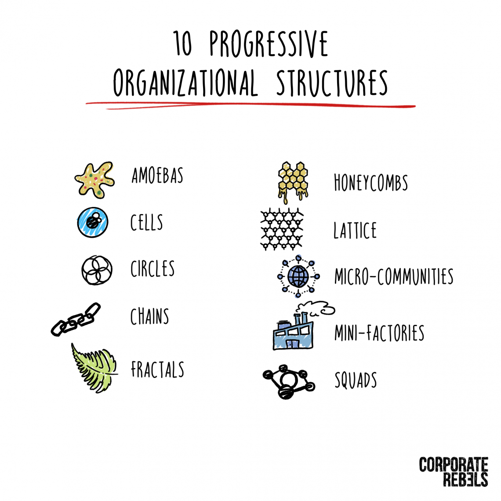

# 2022-04-27

> … progressive organizational structures that are rooted in practice.

> 1. AMOEBAS
> 2. CELLS
> 3. CIRCLES
> 4. CHAINS
> 5. HONEYCOMBS
> 6. LATTICE
> 7. MICRO-COMMUNITIES
> 8. FRACTALS
> 9. MINI-FACTORIES
> 10. SQUADS

[https://corporate-rebels.com/progressive-organizational-structures/](https://corporate-rebels.com/progressive-organizational-structures/)

> I could easily think of about 10 more:
>
> • Handelbanken's Beyond Budgeting model,

> • Semco's Semco-Style model,

> • Morning Star's CLOU-based model,

> • TMC's Employerneurship model,

> • Centigo's Business Wellness model,

> • Vagas' model,

> • Nearsoft's model,

> • Oticon's Spaghetti model,

> • VkusVill's Beyond Taylor model,

> • McCrystal's Team of Teams model.
>
> And I'm sure there are many more out there…
