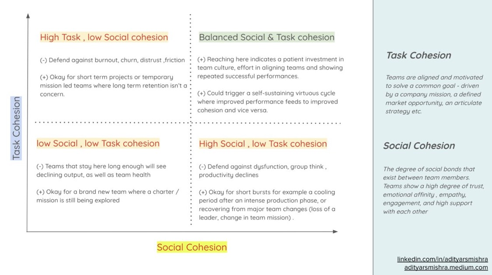

# 2022-09-28 team-cohesion

---
lang: en
tags: [ ... ]
type: photo

---

> Cohesion - how well can teams work together, while keeping their productivity balanced with their emotional health? One can break it down into two key drivers-
>
> 1)Task cohesion - Team alignment with a well-defined strategy. Team is motivated by a common mission such as building something that changes our world, or solving for a customer type they are passionate about.
>
> 2) Social cohesion - Team is connected through strong social bonds. Team members show a high degree of trust, emotional affinity, engagement, and support to each other.

> You can build task cohesion by clearly communicating your mission/vision, encouraging your team to directly interface with customers, building rigorous execution practices etc.
>
> You can build social cohesion by investing in culture, empathy, a positive work environment etc.

<https://www.linkedin.com/posts/adityarsmishra_culture-activity-6820519484307193856-4TPa?utm_source=share&utm_medium=member_ios>

---

Shared to:

• [Springer Nature Slack](https://springernature.slack.com/archives/C7043KKC2/p1664360736530769)
