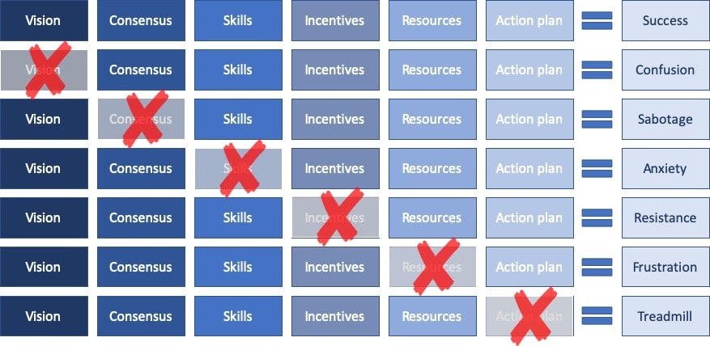
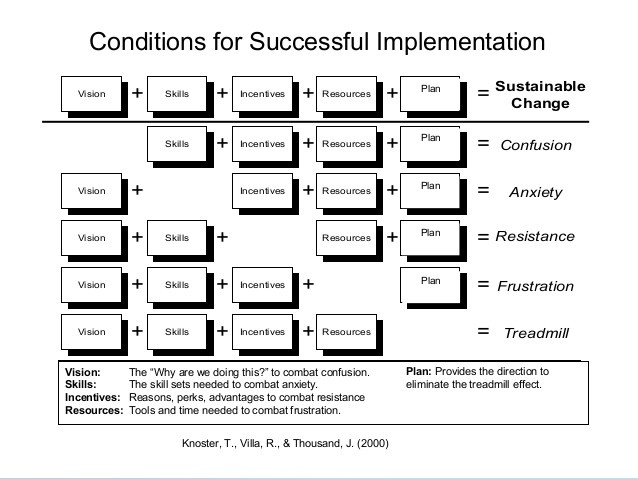

[Models: The Lippitt-Knoster Model for Managing Complex Change | Sergio Caredda](https://sergiocaredda.eu/organisation/tools/models-the-lippitt-knoster-model-for-managing-complex-change/)

> The **Model for Managing Complex Change** is widely used in Change Management presentations and articles around the web, as it outlines required elements fo change, and possible negative outcomes.
>
> …
>
> According to the model, there are [five](https://www.mudamasters.com/en/lean-production-theory/5-elements-succesful-change) or six elements required for [effective change](https://blog.edsmart.com/managing-change-in-schools-a-helpful-framework): vision, consensus, skills, incentives, resources and an action plan. If anyone of these elements is missing, the change effort will fail, with varying Negative Change outcome.

| Element required | Symptom if missing |
|------------------|--------------------|
| Vision           | Confusion          |
| *Consensus*      | *Sabotage*         |
| Skills           | Anxiety            |
| Incentives       | Resistance         |
| Resources        | Frustration        |
| Plan             | Treadmill          |

A good thing about the model:

> … is an excellent tool both to plan Change, as well as to diagnose issues when a project is already happening. It provides a consolidated map of all the elements needed …

A bad thing about the model:

> … it does not provide a sequence of the elements that are needed. Compared to [Kotter’s model](https://sergiocaredda.eu/organisation/tools/models-kotters-eight-steps-process-for-leading-change), for example, it lacks the direction or phasing of the various elements.

---

See also about the 5 elements [Knoster Model](https://www.linkedin.com/pulse/get-grip-managing-change-deploying-knoster-model-michael-nanfito/)

