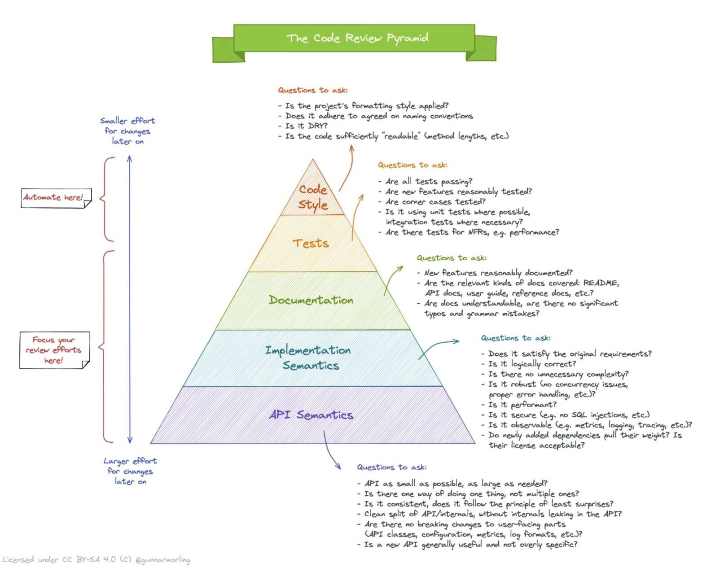

2023-06-04 code-review-pyramid

---
date: 2023-06-04
lang: en
tags: [ software, development, code, review, reference, guidelines ]
type: image
via: "[Gerald Benischke](https://equalexperts.slack.com/archives/C02QDL3SZ/p1685825002725679)"
---

-   Transcribe?

<https://twitter.com/kamrify/status/1664730474068029440?s=12&t=CRTJdFXlXcMMriFKo3jM0g>

See also,
<https://roadmap.sh/code-review>

