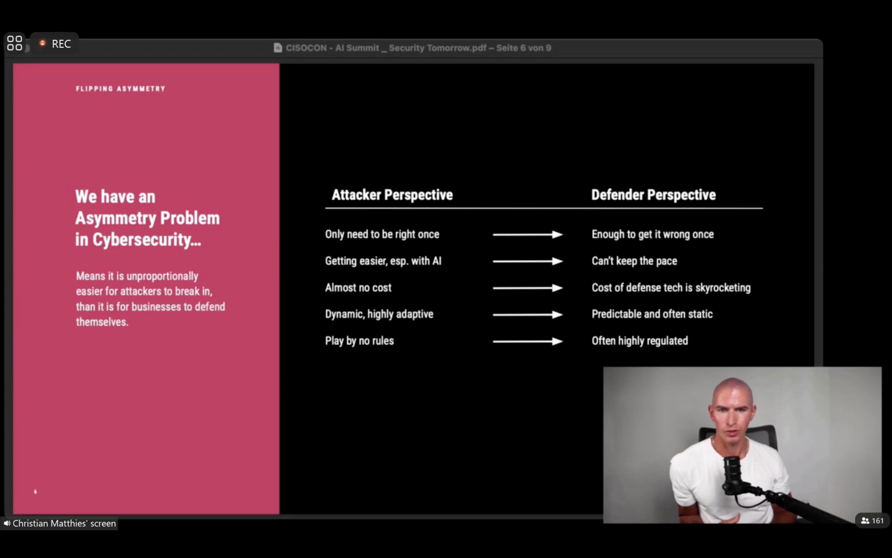
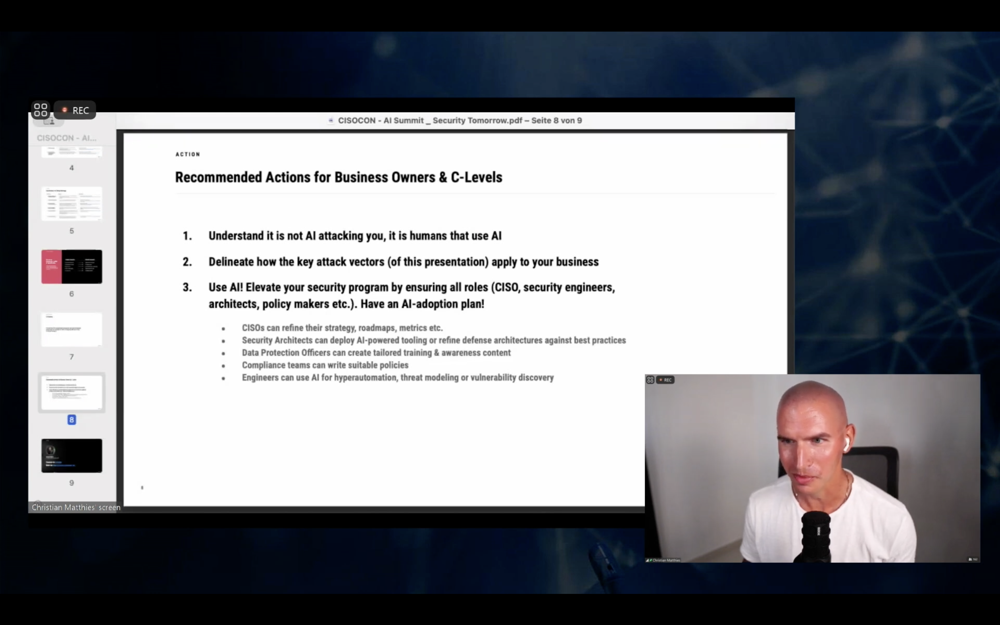

# 2024-03-14

via: [João Pinheiro](https://ctospt.slack.com/archives/CEXHGKK28/p1710147057291979)

Interesting take (and presentation format) about usage of AI in attack/defence vectors
https://www.youtube.com/watch?v=lrV14rWHHnc&amp;ab_channel=MyEOGlobalAISummit

* Put this as a transcribed table?
* Alongside or instead of the pictures?

