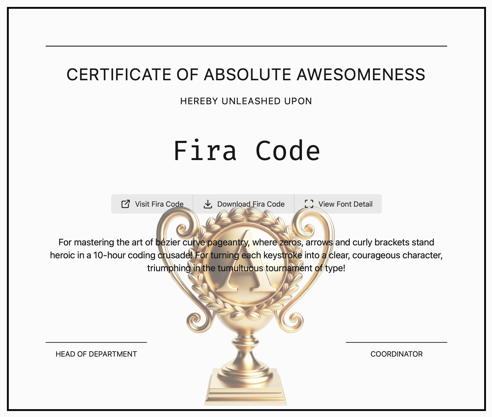
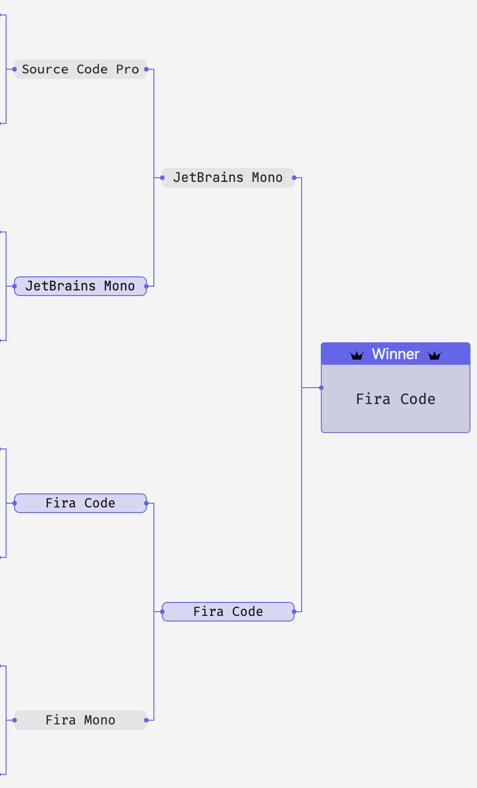

---
aliases:
  - coding-fonts
date: 2024-12-26T13:08:51Z
lang: en
tags: [ tools, programming, fonts, testing, comparison ]
title: Coding Font by Typogram
type: link
via: "[John Gruber](https://daringfireball.net/linked/2024/12/24/coding-font-selection-tournament)"
---

[Coding Font by Typogram](https://www.codingfont.com/)

Choose your favourite in a **coding font shootout** *(don't show the names to remove bias)*.

**My winner:**

🏆 Fira Code

A **representative bracket** for me:

🥇 Fira Code  
🥈 JetBrains   
🥉 Source Code Pro

