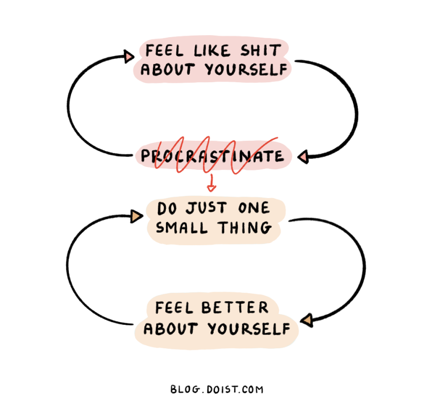

---
aliases:
  - jot
  - jot-method 
date: 2024-04-01T17:42:11
lang: en
tags: [ productivity, procrastination, vicious cycles, virtuous cycles, lifehacks, tips, how to ]
title: "The Just One Thing (JOT) Method"
type: link
---

[The JOT Method](https://mailchi.mp/doist/april-2024)

> Here's how it works:
>
> 1. Take a pen or pencil and turn to a blank page of a notebook.
> 2. Write today's date in the upper left-hand corner.
> 3. Think of one simple task that you've been putting off. Write it down underneath the date.
> 4. Do that task and only that task. Don't write out a to-do list. It's easy to let yourself get distracted by all of the other undone tasks you aren't doing. Just do the one thing you wrote down.
> 5. Once it's done, draw a thin line through the task so that you can still read it, but you know it's complete.
Repeat steps 3-5.

---

> The goal of J.O.T. isn't to get more stuff done. Or even to get more of the "right" stuff done. Instead, the aim is to break the procrastination-paralysis loop right now by proving to yourself that you are, in fact, capable of following through and taking action.

