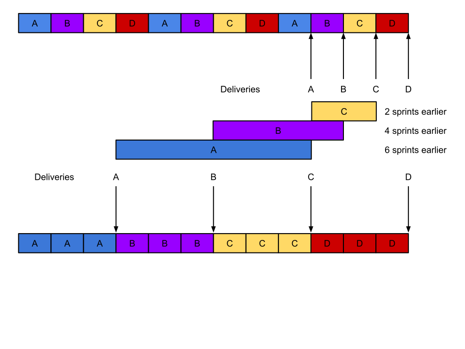

Illustation of how distributing work on 4 streams in parallel will delay the end date of all of them, even though it *seems* like you are making progress in all fronts.

Contrast with the benefits of fully focusing on a single stream at a time, and the impact in has on the end date of 3 of the 4 streams, with the 4th one staying the same.

[Opportunity cost calculation - Google Drawings](https://docs.google.com/drawings/d/1OBQM5Qcgh5W2f8IyowCJrRF16SbaUBXWlTHmgCcN-fU/edit)

