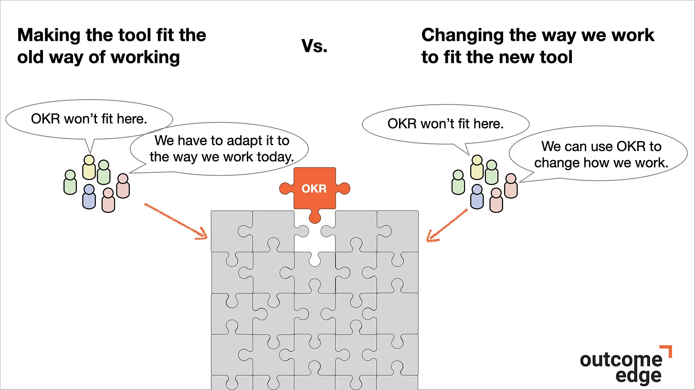
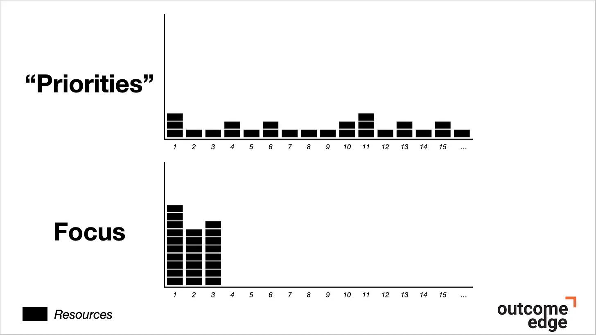
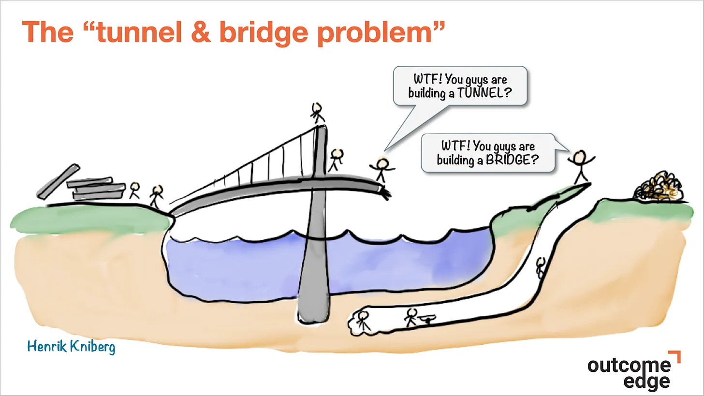

[It’s time to be outcome driven - Felipe Castro - OKR Trainer, Speaker, Author](https://felipecastro.com/en/blog/outcome-driven/)

> As Benedict Evans points out, humans have a clear tendency when they get new tools:
>
> > There’s an old saying that when we get a new tool, we begin by making it fit the old way of working, and then we change the way we work to fit the new tool.
>
> 
>
> 99% of people make OKR fit their old way of working. Like that popular definition of insanity, they keep doing the same thing over and over while expecting different results.

---

> Focus is the hardest muscle to develop. The consequence is that most companies spread their efforts across multiple priorities instead of focusing on the handful of goals that will move the needle.
>
> 

---

> In organizations with weak alignment muscles, people often set OKRs (or goals) in silos, without talking to each other. This leads to the “tunnel & bridge problem,” wonderfully illustrated by Henrik Kniberg:
>
> 
>
> Two teams are trying to reduce the time to cross the river, but one is building a tunnel while the other is building a bridge. I bet you’ve seen this situation before.
