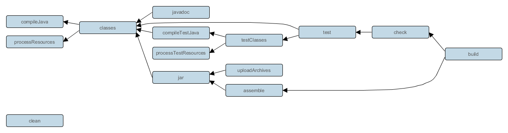

*(most recent on top)*

## Lifecycle of Gradle tasks

* [The Java Plugin # Lifecycle Tasks](https://docs.gradle.org/7.2/userguide/java_plugin.html#lifecycle_tasks)



## Log summary of tests skipped or passed

* [TestLogging - Gradle DSL Version 6.7.1](https://docs.gradle.org/current/dsl/org.gradle.api.tasks.testing.logging.TestLogging.html)

```kotlin
tasks.withType<test> {
    testLogging { events("passed", "skipped", "failed") }
}
```

## Include JUnit 5 tests in all testing tasks

```kotlin
// Affects both `gradlew test` and `gradlew customTestTask`
tasks.withType<test> {
    useJUnitPlatform()
}
```

## Register custom test tasks

```kotlin
tasks.register<Test>("customTestTask") {
    environment("ENV_VAR", "value")
    include("path/to/tests/**")
}
```
