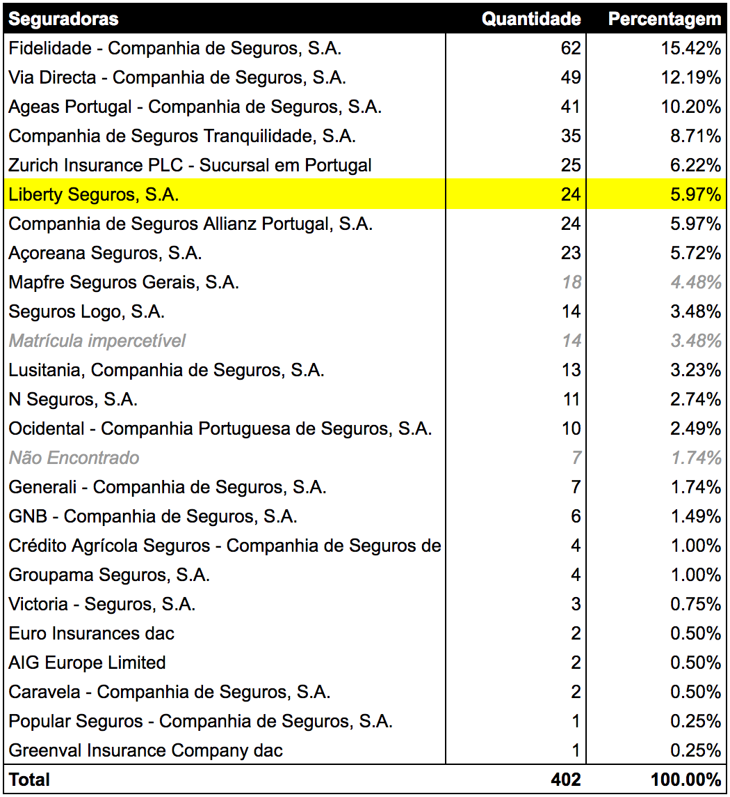

Existem uma série de questões difíceis de responder sobre o incêndio no Andanças, dada a dimensão e falta de informação sobre o mesmo:

* Quantas seguradoras estão envolvidas?
* Quantos veículos sinistrados estão afectos a cada seguradora?
* Quem são as outras pessoas na minha seguradora?

Responder a este tipo de questões tem sido uma das muitas dificuldades do grupo de pessoas prejudicadas pelo incêndio do Andanças (no qual, infelizmente, eu me incluo).

Juntando a informação [publicada pela GNR no espaço do evento](https://postimg.org/gallery/33s2ekfdy/) (gentilmente fotografada pelo [Lucas Apitz](https://www.facebook.com/lucas.apitz)) com os dados do [seguro associado a uma matricula][asfsearch] disponibilizados pela [ASF](http://www.asf.com.pt/) (e uns pózinhos de programação à mistura) consegui ter a noção das várias seguradoras implicadas no incidente e quantos veículos têm segurados.

[asfsearch]: http://www.asf.com.pt/NR/exeres/019EEB91-E357-4A7C-8BD2-B62293701692.htm

Como à data de publicação ainda não tinha recebido resposta da GNR nem encontrado online nenhuma listagem dos veículos em formato digital, podem existir alguns erros na transcrição das matrículas mas que não devem alterar muito os resultados.

Todos os [dados estão disponíveis nesta Google Sheet](https://docs.google.com/spreadsheets/d/1v4UKST2wDLQ-EJeYKpzJMfE0X8OAH1ajoVvwzW1tPe0/edit?usp=sharing): a lista das matrículas dos veículos afectados e a correspondente informação de seguros.

## Seguradoras

Com <del datetime="2016-08-14T14:00:00Z">22</del> **23 seguradoras** envolvidas neste incidente, qualquer esforço de coordenação torna-se muito mais complicado, seja entre as próprias seguradoras, seja entre as pessoas sinistradas.

No entanto uma seguradora, a **Liberty Seguros**, destaca-se de todas pela sua [atitude solidária][pressrelease] de “assumir a reparação dos danos dos seus clientes mesmo que estes apenas tenham contratado apólices de responsabilidade civil contra danos a terceiros”.

[pressrelease]: http://hugo.ferreira.cc/wp-content/uploads/Press-Liberty-Seguros-Festival-Andanças-2016-08-08.pdf

Confesso que à primeira vista pensei que se tratasse de apenas mais uma manobra de marketing, com apenas uma mão cheia de veículos afetos a essa seguradora, mas olhando para a tabela abaixo percebe-se que **outras seguradoras teriam também condições** para oferecer essa benesse.

_Nota: [OK Teleseguros](https://www.okteleseguros.pt/dados-da-empresa/575/) aparece como **Via Directa**_  
_Nota: [Seguro Directo](https://www.segurodirecto.pt/info-legal.html) aparece como **Ageas**_  

## Países

Isto não foi só um problema português. Embora dada a dimensão do incidente os veículos estrangeiros estejam em menor número, é de realçar que cerca de **10% dos veículos** não têm matrícula portuguesa, sendo na sua grande maioria espanhóis.

Se em Portugal já têm ocorrido vários problemas de coordenação entre as entidades responsáveis, seguradoras e sinistrados, e tendo em conta ainda a barreira da língua, decerto que para estas pessoas o passeio de férias a Portugal revelou-se um autêntico pesadelo :(

