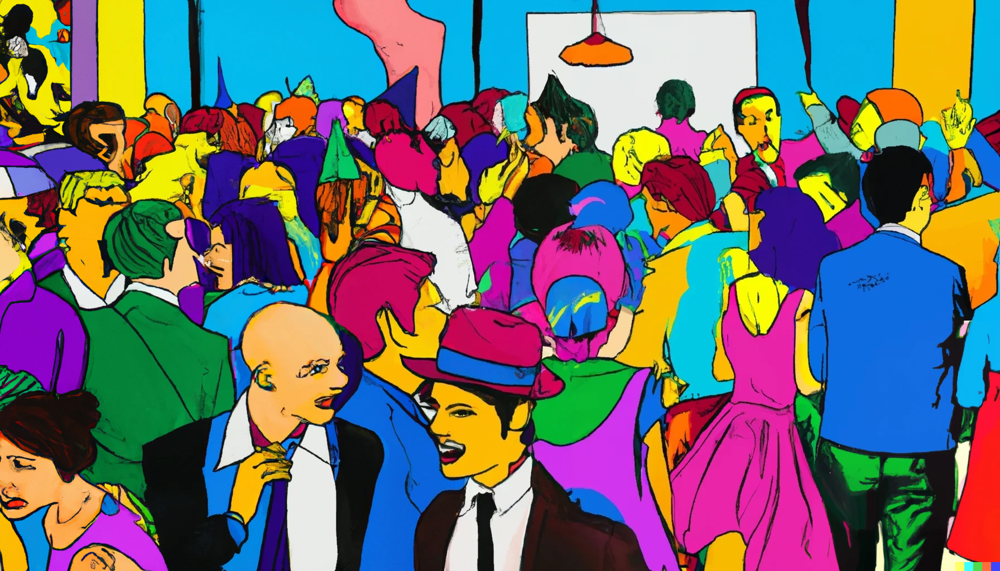

*[DALL·E](https://openai.com/dall-e) — “pop art  painting of a crowded office party with many people”*

Parties and social gatherings with many people can be interesting… or a complete nightmare. Either for work or for family, there are times where we’re not up to it and yet, because we couldn’t get away, we must do attend.

Doesn’t matter what the reasons you have to lack enthusiasm on a particular social gathering. You can be a shy person. Or an introvert[^1] that is needing alone time to recharge your batteries. Or even an extrovert[^2] that isn’t keen on being with a particular group of people.

These tips can help you survive such situations…

[^1]: See book [Quiet: The Power of Introverts in a World That Can’t Stop Talking by Susan Cain | Goodreads](https://www.goodreads.com/book/show/8520610-quiet)
[^2]: See book [The Science of Introverts (And Extroverts and Everyone In-Between) by Peter Hollins | Goodreads](https://www.goodreads.com/book/show/35712351-the-science-of-introverts-and-extroverts-and-everyone-in-between)

---

First things to remember are the following guiding principles:

* Look busy
* Avoid eye contact
* Move around
* Everyone cares about themselves

***Look busy***

Most encounters in social gatherings happen when someone sees you idle. People don’t like to interrupt. So don’t be idle. Read a pamphlet, scribble notes somewhere, pretend to send a text. Your phone is an excellent tool to look busy and avoid people approaching you.

***Avoid eye contact***

At all costs! For real. This is the main invitation signal for people to approach you, even if not immediately. Allowing eye contact, nodding, and other common social rituals, are an open invitation. Close those doors.

***Move around***

A moving target is hard to hit, so always be moving. Be slow, pause for a bit but don’t stay for long in the same place. If you stay put, you’re creating opportunities for other to approach and engage. It’s harder to talk to someone who is going somewhere. People don’t like to interrupt and you can always say you’ll be right back.

***Everyone cares about themselves***

Since everyone’s focused on their own experience, no one cares what you are doing.  People remember the interactions they’ve had, not the ones they didn’t. Who they talked to, not who they didn’t. This opens ample opportunities to survive a party by “walking between the raindrops”.

---

These guiding principles apply is many ways and to many situations. Here are some examples…

*— In a walking around cocktail-style event —*

If you see someone approaching, don’t try to identify who it is. Curiosity killed the cat and you’ll end up creating eye contact by accident. Turn away in a slow page, as if you didn’t notice and go look for something else to do, like choosing what to eat from some tray.

Never join an area of the table with lots of people on it. You might end up eating the less popular food but you need to prioritise avoiding people. That’s what’s more important!

Going to pick up some food but someone anticipates you and gets there first? Pretend something distracted you (a painting on the wall, a flower on a vase, your shoelaces) and buy time. Approach it again only after the person has left. Nothing opens the door to conversation like deciding who gets the last croquette.

Always have food with you. If someone is entering the danger zone looking to chat, start eating, look away and walk out. People tend to not interrupt if your eyes are on your plate and no one expects an answer from someone chewing.

Another option is having a drink with you. Doesn't work so well (taking a sip is too fast compared to chewing a bite) but can be better than nothing.

Are you seeing movements for social games like “musical chairs” or, god forbid, a “conga line”? Great timing to step outside for a smoke, go look for the bathroom or answer some “urgent” messages on your phone.

If someone catches you on the way out and insists you join the “fun”, answer with “yes, I’ll be there right after”. Saying “no” will only make it worse. You become a challenge and will engage their evangelisation impulse. They’ll try to convince you with “it’s so much fun”, “you must join”, “it’s not the same without you”, etc.. Answering “yes, later” fulfils their desire to gather people around and buys you time. Time after which you’ll have no intention of following through, of course.

Don't stay outside too long though. If you abuse it, people will worry where you are and be more motivated to approach you asking if everything is ok.

*— In a sitting down conference-style event —*

Does everyone line up in chairs, like in a cinema, for a talk or to watch some family holiday pictures? While everyone is setting up things, go grab a beer or sneak into the toilet. Let others occupy the seats first. When you’re back, skip the chairs and stand at the very back against the wall. You’ll be safe from happenstance conversation about what you're watching.

Does someone take a wall spot too close to you? Be discrete but be quick (as if you’ve just realised something) and go pick something else to eat or drink. Then stay around that area and don’t return to where you were on the wall. Remember, it’s more important *where* (how isolated) the place you’ve pick something from is, than what you picked up.

Sitting down is risky because it affects your mobility but if you want to sit, avoid clusters of empty chairs. An empty cluster might be appealing because there is no one there. But since there are so many free seats, it’s very risky. Someone outside of your control can sit right beside you and start a conversation.

Choose a chair at the end of a line and pull it way from the others if they are movable. Never sit in chairs in the middle of a row: too many chances to get people on either side of them.

If you can stomach the noise of children, and there are some around, pick a chair next to them. That keep most of the other people at bay, especially guys. If you sense someone approaching, look at what the children are doing as if you’re interested. Give a faint smile and focus on whatever they’re doing or chatting about. This will send a message of “being occupied” and people won’t want to bother you.

*— At the end of the event —*

Never be the first one to leave the party. You’d have to say goodbye to everyone and explain each time why you’re leaving “so early”. Plus, you’ll have to deal with all the “ooh, already?” and “why don’t you stay longer?” departure rituals.

Pay attention to the first people to leave, and take a “ride” with them. Let them take the blunt of the departure ceremonies. Wait for those to finish and the ones staying get tired and give up trying to convince them. Then you can nudge the hosts with a shrugging “I need to leave as well 🤷” and walkout together with the first people. Timing for this is critical but the resistance will now be minimal. You can finally take yourself out of there, into freedom.

---

Being invisible in a crowded party is a *subtle art*. Present and mingling with people, while absent without engaging, and without raising suspicion.

Hope these guiding principles and tips can help you survive such places without harm.

Take care.

*And realise this is a work of fiction, doesn’t necessarily have any parallels with reality… kinda* 😏

<a href="https://giphy.com/gifs/fx-on-hulu-im-kidding-POlRuKwo6HEnZsp3DQ">via GIPHY</a>

