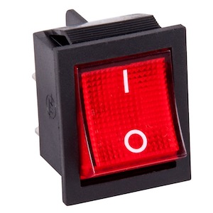

---
cover:
  image: switch-selector.jpg
  alt: on the left, red switch with a 1 on top, a 0 on the bottom, and turned to the 1 position + on the right a coaxial selector with the input on the bottom, an A and B position of top, and the central nob set to the A position
date: 2023-05-15
lang: en
source: "[Springer Nature Slack message, Hugo Ferreira, 2022-07-15](https://springernature.slack.com/archives/C01NT4ECRQ8/p1650618745850389?thread_ts=1650552510.015869&channel=C01NT4ECRQ8&message_ts=1650618745.850389)"
tags: [ programming, data types, booleans, enumerates, comparison, criterion ]
title: Mental model for Booleans vs Enumerates
subtitle: Choosing between Booleans and Enumerates when the options are binary
---

In programming, [Booleans](https://en.wikipedia.org/wiki/Boolean_data_type) and [Enumerates](https://en.wikipedia.org/wiki/Enumerated_type) are common data types to represent the concept of “choice”.

When there are several things to choose from, the Enumerate is the only one to support it, so that’s clear.

But what about when you have two things to choose from? There might be some confusion between both data types since either of them supports handling binary choices.

The confusion arrises in particular when you want to add the choice of a new behaviour, on top of an existing one. For example:

> We're torn between adding a `boolean` called `supportsBarMode` or having a more descriptive model with an `enum` that lists all the supported options `[FooMode, BarMode]`.
>
> The `enum` solution feels a bit [YAGNI](https://en.wikipedia.org/wiki/You_aren't_gonna_need_it) at the moment, but we're open to suggestions. What do you think?

---

Don’t tie yourself to whether you’ll need more options in the future or not. Instead, look at how you can *communicate intent* the best way possible.

The mental model for encoding these binary choices is to identify which of these scenarios we are in:

* **Switch something on/off** — e.g. enabling or disabling an extra option
* **Select mode of operation** — e.g. choosing between ways of doing things

### Boolean = Switch something on/off

A Boolean fits the 1st scenario. A light switch is either on (have light) or off (don’t have light). When it’s off, there’s no “default alternative behaviour” associated with it: the thing we want to turn on just isn’t there.

### Enumerate = Select mode of operation

An Enumerate fits the 2nd scenario. A coaxial selector is either on position A or on position B . It lets you choose between two options. There is a clear meaning associated with each position.

---

In the example above, the Enumerate data type would be the right choice.

> … an `enum` that lists all the supported options `[FooMode, BarMode]`

Even if we never add other options to that Enumerate, it is not a case of [YAGNI](https://en.wikipedia.org/wiki/You_aren't_gonna_need_it). The Enumerate could have only 2 options forever that it would still communicate the correct intent.

---

Shared to:

* [LinkedIn](https://www.linkedin.com/posts/hugocf_mental-model-for-booleans-vs-enumerates-activity-7064254945008529411-hUeH)
* [Mastodon](https://mastodon.online/@hugocf/110378984935193931)
* [Medium](https://hugocf.medium.com/mental-model-for-booleans-vs-enumerates-df70d917fb41)
* [Twitter](https://twitter.com/hugocf/status/1658489697843433472?s=20)

🔒 *(groups)*

* [Springer Nature Slack](https://springernature.slack.com/archives/C01NT4ECRQ8/p1684150514547979?thread_ts=1650552510.015869&cid=C01NT4ECRQ8)
* [Telegram](https://t.me/c/1363309933/8809)