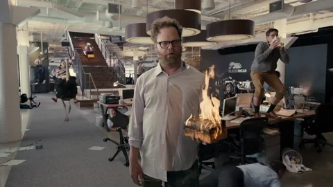

---
cover:
  relative: true
  image: unsplash-firefighter.jpg
  alt: A firefighter using a hose to extinguish a fire in training
  caption: "“[Fireman extinguishing the burning house](https://unsplash.com/photos/e5s4jQxEExo) by [Hush Naidoo Jade Photography](https://unsplash.com/@hush52) [(Unsplash)](https://unsplash.com/)"
date: 2023-04-03T22:16:43Z
lang: en
tags: [ organisations, planning, training, emergencies, strategy, reacting, analogies ]
title: "From Chaos to Strategy: Embracing Firefighting at Work"
subtitle: Did you know firefighters are strategic? So why do we use the term firefighting when we mean “reactive and impulsive”?
summary: We use the analogy of firefighting when people handle unexpected problems at work. Instead of reacting in a chaotic manner like civilians, adopt the strategic approach of trained firefighters. This involves having a plan, clarifying roles, training people and practicing together. Doing so, we can create a better culture of preparedness in our companies.
---

We’ve all heard people say they're in “firefighting mode” or “putting out fires” at work. They mean they’re dealing with unexpected problems and everything feels chaotic. But have you ever thought about *why* we use the analogy of firefighting for this kind of scenario?

Picture a real life fire. People feel confused, scared, and don't know what to do. They’re stressed and drop everything, scrambling around to deal with the emergency. They disperse their focus and their actions are erratic. Chaos is all around.

*[Source](https://media.giphy.com/media/v1.Y2lkPTc5MGI3NjExODY4OGIxZTZlNmE1NDgxMTg1NDk0YTY1ZTJiZDZhNGI3ODUyOTMxOSZjdD1n/ZD8ZjehSsLDZQRKJjJ/giphy.gif)*

As you can imagine, I don‘t think this is how we should react. What might surprise you is that I don’t think the analogy is wrong. I’d argue though, that we should embrace it even further.

## Even firefighting needs a strategy

**Trained firefighters** make up another crucial group of people in firefighting. Their *actions* and *attitudes* are completely different from those described above:

* They have a well thought out **strategy** for tackling fires, which they adjust to the reality on the ground
* They have pre-established **roles** and **communication** lines, so everyone knows what to do
* They follow **safety rules** of engagement based on their learnings from past emergencies
* They **train** together, in controlled environments simulating reality, to improve their coordination

With this, they are ready to handle emergencies with calm and expertise. When fires do occur, they feel “familiar”. Even considering the natural levels of stress and adrenaline involved in these situations.

*[Source](https://www.youtube.com/shorts/UQLUP6PwGRk)*

Consider the case of forest fires and how trained firefighters behave when they’re on the scene:

* Headquarters coordinates efforts based on constant reports from the field
* Coordination teams choose where to best deploy their people and physical resources
* They take changing context into account (e.g. weather and wind forecasts) to decide which fire fronts to attack first
* At times, they even decide which areas to let burn to create a natural barrier for other advancing fires

---

So, why can't we operate in a similar way in our companies? Why are we in constant in firefighting mode, reacting to emergencies as they arise?

We can choose to look at “firefighting” in a strategic way. We can seek to act like “trained firefighters”, rather than in a chaotic way like “civilians”:

* **Have a plan** in place for handling unexpected problems
* Make sure people **understand their role** in responding to unexpected challenges
* **Train** people on **how to respond** to crises in a calm and efficient manner
* **Practice** how to **work together** to find solutions in emergencies

This way we can create a better culture of preparedness in our companies. Like trained firefighters, we can be ready to handle whatever challenges come our way.

So, the next time you find yourself in firefighting mode at work, remember that you have a choice. Don’t react in a chaotic manner, like a civilian in a fire. **Be strategic like a trained firefighter.**

---

Shared to:

* [LinkedIn](https://www.linkedin.com/posts/hugocf_from-chaos-to-strategy-embracing-firefighting-activity-7048651523198754817-ZODQ)
* [Mastodon](https://mastodon.online/@hugocf/110142785028504109)
* [Medium](https://hugocf.medium.com/from-chaos-to-strategy-embracing-firefighting-at-work-1ec65a6be852)
* [Twitter](https://twitter.com/hugocf/status/1642784438873407489)

🔒 *(groups)*

* [iOS PT Slack](https://ios.slack.com/archives/C0721L3CL/p1680511769840369)
* [SA-IL Slack](https://sa-il.slack.com/archives/CQ32FU1SR/p1680539980852139)
* [Telegram](https://t.me/c/1363309933/8513)
