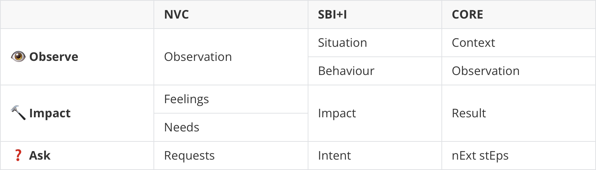

---
cover:
  relative: true
  image: eye-hammer-question.jpeg
  alt: an eye, a hammer and question mark, side-by-side next to each other in graffiti style
  caption: "[Image Creator from Microsoft Bing](https://www.bing.com/images/create) — “an eye, a hammer and question mark, side-by-side in random painting art styles”"
date: 2023-06-13
lang: en
tags: [ guidelines, feedback, observing, compassion, behaviours, feelings, needs ]
title: Speaking or communicating? Easily recall how to give good feedback
summary: There are many guidelines on how to structure feedback but human nature is quite common. A simple mnemonic will help your recall your favourite framework when it matters the most — talk about what you “observe”, its “impact” and then “ask”.
---

Negative feedback is never easy to impart on others. Emotions and ego tend to trigger defensive behaviour. This, in turn, creates friction and noise in the communication.

There are several structured ways to help us shape our message for others in a way that helps people receive it well. Unfortunately, some of them are useless and even disrespectful (e.g. the [“shit” sandwich](https://www.forbes.com/sites/forbeshumanresourcescouncil/2022/04/25/why-the-sandwich-approach-to-criticism-is-terrible-advice/), and [others](http://blog.idonethis.com/sandwich-feedback-performance-management/)).

The following frameworks are ones that I've found more useful and helpful.

---

[**NVC - Nonviolent Communication**](https://en.wikipedia.org/wiki/Nonviolent_Communication) *by Marshall Rosenberg ([CNVC](https://www.cnvc.org/))*

An approach to communication based on principles of nonviolence. Was developed by clinical psychologist Marshall Rosenberg beginning in the 1960s and 1970s.

This is a very popular approach, with lots of books, articles and training going around for it.

* **Observation** — Facts we are seeing, hearing, or touching, as distinct from our evaluation of them
* **Feelings** — Emotions or sensations, free of thought and story
* **Needs** — Universal human needs, as distinct from particular strategies for meeting those needs
* **Requests** — Distinguished from demands in that one is open to hearing a response of "no" without this triggering an attempt to force the matter

---

[**SBI+I - Situation-Behavior-Impact + Intent**](https://www.ccl.org/articles/leading-effectively-articles/closing-the-gap-between-intent-vs-impact-sbii/) *by Center for Creative Leadership ([CCL](https://www.ccl.org/))*

A more niche approach written in 2022, from a nonprofit organisation focused on leadership. Their goal is improving the understanding, practice, and development of leadership.

* **Situation** — Clarify and describe what happened, when and where
* **Behavior** — Describe the observable behaviour, without assuming what the person was thinking
* **Impact** — Explain what you thought or felt in reaction to the behavior
* **Intent** — Inquire about their original intentions, to clarify the gap between intent vs. impact

---

[**CORE - Context, Observation, Result, nExt stEps**](https://www.radicalcandor.com/core-feedback/) *by Kim Scott ([Radical Candor](https://www.radicalcandor.com/the-book/) book)*

From the author of a best seller in the business category, published in 2017. This method makes sure you’re not criticising someone’s personality when delivering negative feedback (or even praise).

* **Context** — Cite the specific situation
* **Observation** — Describe what was said or done
* **Result** — What is the most meaningful consequence to you and to them?
* **nExt stEps** — What are the expected next steps?

---

**A simple mnemonic to remember**

As you can see, there’s plenty to study and choose from. I recommend you look through the methods in more detail and see what you can relate with more. Practice it whenever you have a chance…

In reality though, situations that bother you and demand these tools happen in real time. Quite often, the timing to say something is in the moment and it’s hard to remember all the above rules.

Unless you’ve practiced enough for these concepts to become [unconscious competence](https://en.wikipedia.org/wiki/Four_stages_of_competence) (i.e. have an intuitive level of familiarity with these tools), it can be hard to remember how to say things on the spot.

While still in the [conscious competence](https://en.wikipedia.org/wiki/Four_stages_of_competence) phase, this **simple mnemonic** has helped me recall how to structure my feedback:

* 👁️ … talk about what you **Observe**
* 🔨 … talk about what was the **Impact**
* ❓ … then **Ask** a question as follow up

This is because there’s a natural overlap between the methods. They emphasise different parts of the conversation. The authors chose different terms for similar underlying principles. But human nature is constant.

<!--
<table>
	<thead>
		<tr>
			<th> </th>
			<th>NVC</th>
			<th>SBI+I</th>
			<th>CORE</th>
		</tr>
	</thead>
	<tbody>
		<tr>
			<td rowspan="2">👁️ <strong>Observe</strong></td>
			<td rowspan="2">Observation</td>
			<td>Situation</td>
			<td>Context</td>
		</tr>
		<tr>
			<td>Behaviour</td>
			<td>Observation</td>
		</tr>
		<tr>
			<td rowspan="2">🔨 <strong>Impact</strong></td>
			<td>Feelings</td>
			<td rowspan="2">Impact</td>
			<td rowspan="2">Result</td>
		</tr>
		<tr>
			<td>Needs</td>
		</tr>
		<tr>
			<td>❓ <strong>Ask</strong></td>
			<td>Requests</td>
			<td>Intent</td>
			<td>nExt stEps</td>
		</tr>
	</tbody>
</table>
-->

---

One more thing…

Beyond the scope of “negative feedback”, we are sometimes asked to provide general feedback about other people. Could be about a new hire during their probation period. Could be preparing for a “[speedback](https://medium.com/@joshproduct/speedback-de-stigmatise-feedback-with-speed-dating-principles-4708d493fb63)” session with team members. Could be many other scenarios.

What should we say? What can we talk about?

An easy way to identify topics to talk about is to brainstorm using the **“start, stop, continue”** pattern:

* **Start** — Think whether there are things the person should do, which they are not currently doing
* **Stop** — Think if you can see anything that the person should not do anymore
* **Continue** — Think about if some of the person’s current behaviours they should maintain

All this is, is a guide to *think* about different “things to say”:

* You don’t need to be exhaustive in covering the 3 aspects
* You can have several things to say for the same aspect
* You don’t have to follow this specific order
* You can mix and match different aspects, as it feels more natural to you

Happy feedback 🙂

---

Shared to:

* [LinkedIn](https://www.linkedin.com/posts/hugocf_speaking-or-communicating-easily-recall-activity-7074358582716116992-3-A3)
* [Mastodon](https://mastodon.online/@hugocf/110536856147168624)
* [Medium](https://hugocf.medium.com/)
* [Twitter](https://twitter.com/hugocf/status/1668593984455729152)

🔒 *(groups)*

* [Telegram](https://t.me/c/1363309933/8956)

